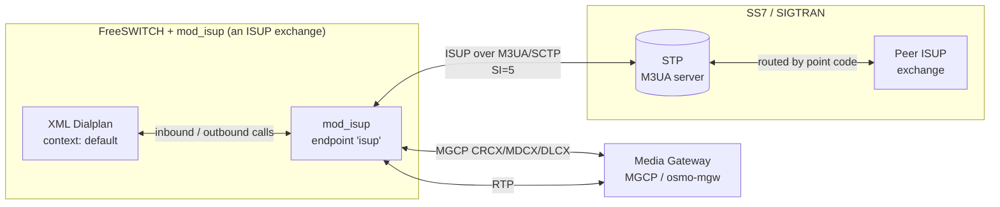

# mod_isup Operations Guide

`mod_isup` is a FreeSWITCH endpoint module that acts as an **ISUP-over-M3UA MGCF**
(Media Gateway Control Function). It bridges SS7 ISUP calls — carried over
M3UA/SCTP to a Signalling Transfer Point (STP) — to and from FreeSWITCH, while
the media bearer is controlled over MGCP against an external Media Gateway (MGW).

Signalling and media are split:

- **Signalling** — ISUP messages (IAM, ACM, ANM, REL, RLC, …) ride M3UA as the
  SI=5 MTP-User, exchanged with a peer exchange through the STP.
- **Media** — the RTP bearer is set up on an external MGW (e.g. `osmo-mgw`) via
  MGCP; FreeSWITCH streams RTP to/from the gateway endpoint.

## Documentation

- **[Configuration Reference](./configuration.md)** — the config files (cs7 VTY
  config, environment variables, FreeSWITCH module loading) and every parameter.
- **[fs_cli Commands](./fs-cli-commands.md)** — loading the module and the `isup`
  OAM commands (`status`, `m3ua`, `mgw`, `cic`, `sccp`).
- **[Call Routing](./call-routing.md)** — placing outbound ISUP calls
  (`originate`) with IAM parameters, and routing inbound ISUP calls through the
  dialplan.
- **[Design Notes](./mod_isup_design.md)** — architecture and protocol design.

## Architecture Overview



A FreeSWITCH instance running `mod_isup` hosts **one or more ISUP profiles** —
independent trunks (like SIP profiles in `mod_sofia`). All profiles share **one
M3UA transport** (a single association to the STP); each profile has its own
**Originating Point Code (OPC)**, **CIC numbering**, and **MGW**, and signals to
its own peer (a **Destination Point Code, DPC**). Inbound messages are demuxed to
the profile whose OPC is the message's destination point code.

## Key Concepts

| Term | Meaning |
|------|---------|
| **OPC** | Originating Point Code — this exchange's own SS7 address. |
| **DPC** | Destination Point Code — the peer exchange calls are routed toward. |
| **CIC** | Circuit Identification Code — one per voice circuit (trunk timeslot). Each concurrent call occupies one CIC. |
| **ASP** | Application Server Process — the M3UA association from this exchange to the STP. Must be `ACTIVE` to signal. |
| **Routing context** | M3UA identifier the STP uses to bind this exchange's routing key. Must match the STP's peer configuration. |
| **MGW** | Media Gateway — the external element that anchors and bridges the RTP bearer, controlled over MGCP. |

## Quick Reference

| Task | Command |
|------|---------|
| Load the module | `fs_cli -x "load mod_isup"` |
| Confirm loaded | `fs_cli -x "module_exists mod_isup"` |
| Check M3UA / circuit status | `fs_cli -x "isup status"` |
| Place an ISUP call | `fs_cli -x "originate isup/trunk-a/1002 &echo"` |

## Operating State

`mod_isup` is ready to carry calls only when the shared M3UA ASP is **ACTIVE**.
On a healthy exchange, `isup status` reports the transport and each profile:

```
M3UA ASP asp-clnt-stp : ACTIVE   (2 profile(s))
SCCP (SI=3)      : disabled
profile 'trunk-a': OPC=607  peer-DPC=608  NI=2  MGW=10.179.1.201:2427  CIC 1-4 (0 in use)
profile 'trunk-b': OPC=609  peer-DPC=610  NI=2  MGW=10.179.1.202:2427  CIC 1-8 (0 in use)
```

If the ASP shows `down`, no ISUP calls will complete — see
[fs_cli Commands → Troubleshooting](./fs-cli-commands.md#troubleshooting).

## Standards

`mod_isup` implements ITU-T ISUP over M3UA:

| Area | Reference |
|------|-----------|
| ISUP messages & parameters | [ITU-T Q.762](https://www.itu.int/rec/T-REC-Q.762) / [Q.763](https://www.itu.int/rec/T-REC-Q.763) |
| ISUP call control procedures | [ITU-T Q.764](https://www.itu.int/rec/T-REC-Q.764) |
| M3UA (MTP3-User Adaptation) | [RFC 4666](https://datatracker.ietf.org/doc/html/rfc4666) |
| MGCP (bearer control) | [RFC 3435](https://datatracker.ietf.org/doc/html/rfc3435) |
