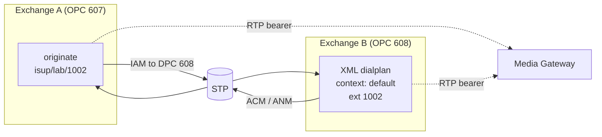
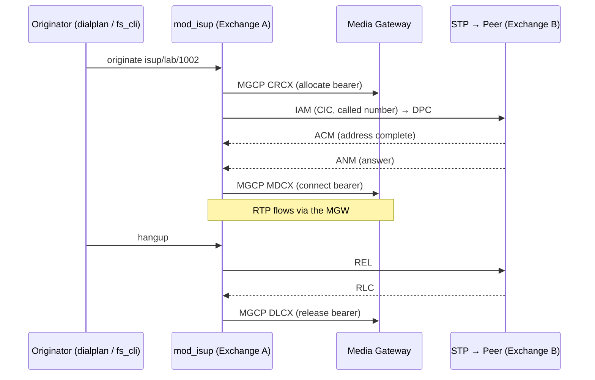

# mod_isup Call Routing

`mod_isup` presents an endpoint called **`isup`**. Calls flow in two directions:

- **Outbound** — FreeSWITCH `originate` (or a dialplan `bridge`) to `isup/…`
  sends an ISUP **IAM** toward the peer exchange and sets up the bearer on the
  MGW.
- **Inbound** — an incoming ISUP **IAM** creates a FreeSWITCH channel that enters
  the **XML dialplan** in the `default` context, keyed on the called number.



---

## Outbound Calls

### Dial string

```
isup/<profile>/<number>
```

| Element | Description |
|---------|-------------|
| `<profile>` | The ISUP profile name — currently `lab`. |
| `<number>` | The called party number, placed in the IAM's Called Party Number. Only the text after the last `/` is used. |

Example:

```
originate isup/lab/1002 &echo
```

### How a circuit is chosen

On each outbound call the module selects the **first idle CIC** in the
configured range (`1`–`4`). The IAM is routed to the profile's peer DPC
(the `peer-dpc` setting). If no circuit is idle, the call is rejected with
`NORMAL_CIRCUIT_CONGESTION`. If the start-up group reset has not completed, the
call is rejected with `NORMAL_TEMPORARY_FAILURE` (Q.764 §2.9.1) — retry shortly.

### IAM parameters (channel variables)

Mandatory IAM parameters have sensible defaults and can be overridden per call
with channel variables, using the standard `originate {var=value,…}` prefix:

```
originate {isup_tmr=3k1,isup_cpc=payphone,isup_calling_number=0738900000}isup/lab/1002 &echo
```

| Variable | Type | Default | Description |
|----------|------|---------|-------------|
| `isup_tmr` | Enum | `speech` | Transmission Medium Requirement (e.g. `speech`, `3k1` for 3.1 kHz audio). Sets the bearer capability requested in the IAM. |
| `isup_cpc` | Enum | `ordinary` | Calling Party's Category (e.g. `ordinary`, `payphone`). |
| `isup_fci` | Hex | `6010` | Forward Call Indicators (2 octets), controlling ISUP interworking/priority flags. |
| `isup_nci` | Hex | `00` | Nature of Connection Indicators. Set a continuity-check bit here to request a continuity check on the circuit. |
| `isup_called_noa` | Enum | `national` | Called Party Number — Nature of Address (e.g. `national`, `international`, `subscriber`). |
| `isup_called_npi` | Integer | ISDN | Called Party Number — Numbering Plan Indicator. |
| `isup_calling_number` | String | caller ID | Calling Party Number digits. Falls back to the channel's caller-ID number if unset. |
| `isup_calling_noa` | Enum | `national` | Calling Party Number — Nature of Address. |
| `isup_calling_pres` | Enum | allowed | Presentation: `restricted` sets CLIR (number presentation restricted). Also honours the channel's hide-number flag. |
| `isup_calling_screening` | Integer | network-provided | Calling Party Number — screening indicator. |
| `isup_hop_counter` | Integer | unset | Optional IAM hop counter, decremented at each exchange to bound looping. |

### Outbound call flow



---

## Inbound Calls

When an IAM arrives, `mod_isup` creates a FreeSWITCH channel and passes it to the
dialplan:

| Property | Value |
|----------|-------|
| Dialplan engine | `XML` |
| Context | `default` |
| Destination number | The IAM's Called Party Number |
| Caller ID number | The IAM's Calling Party Number |

Operators write ordinary XML dialplan extensions in the `default` context to
handle inbound ISUP calls. The dialplan controls ringing and answer via the
usual applications (`ring_ready`, `answer`, `bridge`, `playback`, …).

### Example: answer and bridge inbound ISUP to a SIP gateway

```xml
<context name="default">
  <extension name="isup_inbound_1002">
    <condition field="destination_number" expression="^1002$">
      <action application="ring_ready"/>
      <action application="answer"/>
      <action application="bridge" data="sofia/gateway/mygw/61738900000"/>
    </condition>
  </extension>
</context>
```

**How it works:** an inbound IAM with called number `1002` matches this
extension. `ring_ready` triggers the backward **ACM**; `answer` triggers the
**ANM** and connects the bearer on the MGW; `bridge` connects the call leg
onward. On hangup the module sends **REL**/**RLC** and releases the bearer.

**Use case:** terminating SS7 ISUP trunk calls into a SIP/IMS core, or into
another FreeSWITCH application.

### Example: answer and play a tone/announcement

```xml
<context name="default">
  <extension name="isup_inbound_announce">
    <condition field="destination_number" expression="^.*$">
      <action application="answer"/>
      <action application="playback" data="tone_stream://%(2000,4000,440,480)"/>
      <action application="hangup" data="NORMAL_CLEARING"/>
    </condition>
  </extension>
</context>
```

**How it works:** any inbound ISUP call is answered (ANM), a ringback-style tone
is streamed over the MGW bearer, then the call is released with a normal ISUP
cause.

---

## Point-Code Routing

Which exchange a call reaches is determined by point codes, not by the dialled
number alone:

- Outbound IAM is addressed to the **`peer-dpc`** point code and handed to the STP.
- The **STP** routes the message to whichever exchange owns that point code,
  using its own routing table.
- The dialled number then selects an **extension within** the terminating
  exchange's `default` context.

To route calls between two `mod_isup` exchanges, each must:

1. Have a distinct **OPC** and be registered/`ACTIVE` on the STP.
2. Set its `peer-dpc` to the other exchange's OPC.
3. Be provisioned on the STP so the STP will route each point code to the correct
   exchange.

See [Configuration Reference](./configuration.md) for point-code and routing
configuration.
