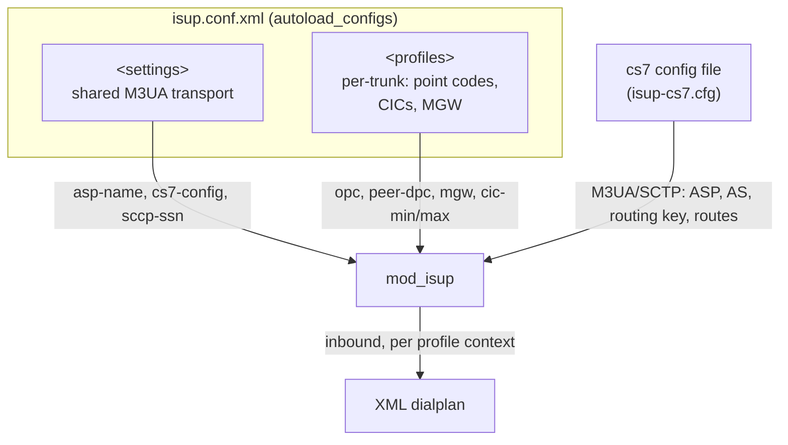

# mod_isup Configuration Reference

`mod_isup` runs **one or more ISUP profiles** — independent trunks, much like SIP
profiles/gateways in `mod_sofia`. All profiles share **one M3UA transport** (a
single SCTP association / ASP to the STP); each profile has its own **point
codes**, **CIC numbering**, and **MGW**.

It is configured through **two** files plus the FreeSWITCH module loader:



| File | Purpose |
|------|---------|
| **`isup.conf.xml`** | `<settings>` for the shared M3UA transport, and `<profiles>` — one `<profile>` per ISUP trunk (its point codes, CIC range, MGW, inbound context/dialplan). Read through the standard FreeSWITCH XML config framework. |
| **cs7 config file** | The SIGTRAN transport: the single M3UA association (ASP) to the STP, the Application Server (AS), the routing key, and the route table. Standard Osmocom `cs7` VTY syntax. Its path is the `cs7-config` setting. |
| **`modules.conf.xml`** | Controls whether the module auto-loads at start-up. It can also be loaded on demand with `load mod_isup`. |

## Configuration File Locations

| Item | Default location | Set by |
|------|------------------|--------|
| Module config | `<conf>/autoload_configs/isup.conf.xml` | — |
| cs7 config file | `/usr/local/freeswitch/conf/isup-cs7.cfg` | `cs7-config` in `<settings>` |
| Module load config | `<conf>/autoload_configs/modules.conf.xml` | — |

---

## isup.conf.xml

Place `isup.conf.xml` in the FreeSWITCH `autoload_configs/` directory. It has a
`<settings>` block (the shared transport) and a `<profiles>` block (the trunks).

```xml
<configuration name="isup.conf" description="ISUP-over-M3UA MGCF">

  <!-- Shared M3UA transport: one SCTP association / ASP for all profiles -->
  <settings>
    <param name="asp-name" value="asp-clnt-stp"/>
    <param name="cs7-config" value="/usr/local/freeswitch/conf/isup-cs7.cfg"/>
    <param name="sccp-ssn" value="0"/>
  </settings>

  <!-- One or more ISUP trunk profiles over that transport -->
  <profiles>
    <profile name="trunk-a">
      <param name="opc" value="607"/>
      <param name="peer-dpc" value="608"/>
      <param name="network-indicator" value="2"/>
      <param name="mgw" value="10.179.1.201:2427"/>
      <param name="cic-min" value="1"/>
      <param name="cic-max" value="4"/>
      <param name="context" value="default"/>
      <param name="dialplan" value="XML"/>
      <param name="auto-answer" value="false"/>
    </profile>
    <profile name="trunk-b">
      <param name="opc" value="609"/>
      <param name="peer-dpc" value="610"/>
      <param name="mgw" value="10.179.1.202:2427"/>
      <param name="cic-min" value="1"/>
      <param name="cic-max" value="8"/>
    </profile>
  </profiles>

</configuration>
```

### Shared transport — `<settings>`

These configure the single M3UA association shared by all profiles.

| Parameter | Type | Required | Default | Description |
|-----------|------|----------|---------|-------------|
| `asp-name` | String | No | `asp` | Name of the M3UA ASP to bring up. **Must exactly match the `asp` name in the cs7 config**, otherwise the association is never started and the ASP stays `down`. |
| `cs7-config` | String | No | `/usr/local/freeswitch/conf/isup-cs7.cfg` | Path to the cs7 transport config file (below). If missing or invalid, the module fails to load. |
| `sccp-ssn` | Integer | No | `0` | If greater than 0, binds an SCCP (SI=3) user on the same association with this Subsystem Number, reserved for a future TCAP/MAP layer. `0` leaves SCCP off. |

### Per-profile — `<profile name="…">`

Each `<profile>` is an independent ISUP trunk. Its `name` attribute is used in
the dial string (`isup/<name>/<number>`) and in `isup status`.

| Parameter | Type | Required | Default | Description |
|-----------|------|----------|---------|-------------|
| `opc` | Integer | No | `1` | This trunk's **Originating Point Code** (decimal). Inbound ISUP messages whose destination point code equals this OPC are routed to this profile. Must match the point code the STP has provisioned for the trunk. **Each profile must have a distinct OPC.** |
| `peer-dpc` | Integer | No | `2` | **Destination Point Code** of the peer exchange this trunk's outbound calls (IAM) are routed toward. |
| `network-indicator` | Integer | No | `2` | SS7 network indicator applied to this trunk's outgoing messages (`0` = international, `2` = national, per [ITU-T Q.704](https://www.itu.int/rec/T-REC-Q.704)). |
| `mgw` | String | No | `127.0.0.1:2427` | `host:port` of the MGCP Media Gateway used for this trunk's bearer. Profiles may use different MGWs. |
| `cic-min` | Integer | No | `1` | Lowest Circuit Identification Code for this trunk. |
| `cic-max` | Integer | No | `4` | Highest CIC. The circuit count (`cic-max − cic-min + 1`) is the trunk's maximum concurrent calls. Each profile has its own CIC numbering. |
| `context` | String | No | `default` | Dialplan context this trunk's inbound calls enter — see [Call Routing](./call-routing.md). |
| `dialplan` | String | No | `XML` | Dialplan engine for inbound calls. |
| `auto-answer` | Boolean | No | `false` | When `true`, the module answers this trunk's inbound calls itself (demo/loopback) instead of leaving answer control to the dialplan. Leave `false` for normal operation. |

### Environment Variable Overrides

The shared-transport settings can be overridden at start-up by environment
variables on the FreeSWITCH process. When **exactly one** profile is defined,
the identity variables also override it — this preserves the containerised
single-exchange pattern (one container = one trunk). **`isup.conf.xml` is the
canonical configuration;** environment variables, when set, take precedence.

| Environment variable | Overrides |
|----------------------|-----------|
| `ISUP_ASP_NAME` | `asp-name` (shared) |
| `ISUP_CS7_CFG` | `cs7-config` (shared) |
| `ISUP_SCCP_SSN` | `sccp-ssn` (shared) |
| `ISUP_PROFILE` | the synthesised profile's name when no `<profiles>` are configured |
| `ISUP_OPC` | `opc` (single-profile only) |
| `ISUP_PEER_DPC` | `peer-dpc` (single-profile only) |
| `ISUP_MGW` | `mgw` (single-profile only) |
| `ISUP_AUTOANSWER` | `auto-answer` (single-profile only) |

---

## cs7 Config File

The cs7 file configures the shared M3UA/SCTP transport using standard Osmocom
`cs7` VTY syntax (as used by `libosmo-sigtran`). It defines the single SCTP
association to the STP, the Application Server, and how ISUP messages are routed.
Its path is the `cs7-config` setting.

```
log stderr
 logging level set-all notice
line vty
 no login
cs7 instance 0
 network-indicator international
 point-code 0.75.7
 asp asp-clnt-stp 2905 2906 m3ua
  remote-ip 10.179.4.10
  role asp
  sctp-role client
 as as-clnt-isup m3ua
  asp asp-clnt-stp
  routing-key 20 0.75.7
 route-table system
  update route 0.0.0 0.0.0 linkset as-clnt-isup
```

The instance's `point-code` is the association's primary point code; the STP
routes each profile's OPC to this one ASP, and `mod_isup` demuxes inbound
messages to the owning profile by destination point code.

### Global directives

| Directive | Description |
|-----------|-------------|
| `log stderr` / `logging level set-all notice` | Sends the SIGTRAN stack's own log to stderr at `notice` level. Raise to `debug` when diagnosing association problems. |
| `line vty` / `no login` | Enables the embedded VTY without a login prompt. Required boilerplate. |

### `cs7 instance` parameters

| Parameter | Type | Required | Default | Description |
|-----------|------|----------|---------|-------------|
| `cs7 instance` | Integer | Yes | `0` | The SS7 instance number. `mod_isup` uses instance `0`. |
| `network-indicator` | Enum | Yes | — | SS7 network indicator: `international`, `national`, `national-spare`, or `reserved`. **Must match the STP and peer.** |
| `point-code` | Point code | Yes | — | The association's primary point code, in `network.cluster.member` (3-8-3) form. `0.75.7` = decimal `607`. |

### `asp` parameters (the M3UA association)

Syntax: `asp <name> <remote-port> <local-port> <protocol>`

| Field | Type | Required | Default | Description |
|-------|------|----------|---------|-------------|
| `<name>` | String | Yes | — | ASP name. **Must equal `asp-name`** in `<settings>` so the module starts this association. |
| `<remote-port>` | Integer | Yes | `2905` | The STP's SCTP port. M3UA standard port is 2905. |
| `<local-port>` | Integer | Yes | — | The SCTP **source port** this exchange binds. Pin a fixed value (e.g. `2906`) when the STP matches peers by source port, or when running more than one exchange from the same source IP. |
| `<protocol>` | Enum | Yes | `m3ua` | Adaptation layer. `mod_isup` uses `m3ua`. |
| `remote-ip` | IP | Yes | — | The STP's IP address. |
| `role` | Enum | Yes | `asp` | M3UA role. This exchange is always the `asp` (the STP is the SG/server). |
| `sctp-role` | Enum | Yes | `client` | SCTP association role. `client` — this exchange initiates the association to the STP. |

### `as` parameters (the Application Server)

Syntax: `as <name> <protocol>`

| Parameter | Type | Required | Default | Description |
|-----------|------|----------|---------|-------------|
| `as <name>` | String | Yes | — | Application Server name (local label). |
| `<protocol>` | Enum | Yes | `m3ua` | Adaptation layer; `m3ua`. |
| `asp <name>` | Reference | Yes | — | Binds the ASP (above) into this AS. |
| `routing-key` | `<rctx> <point-code>` | Yes | — | The M3UA routing key: the **routing context** the STP expects (`20`) and the association's point code (`0.75.7`). The routing context **must match the STP's provisioned peer**, or the STP rejects the association. |

### `route-table` parameters

| Parameter | Type | Required | Default | Description |
|-----------|------|----------|---------|-------------|
| `route-table system` | — | Yes | — | Selects the system route table. |
| `update route <dpc> <mask> linkset <as>` | Route entry | Yes | — | Directs outbound MTP traffic to the AS. `0.0.0 0.0.0` is a default (catch-all) route sending all ISUP messages to the STP via `as-clnt-isup`; the STP forwards them to the real destination point code. |

---

## Loading the Module in FreeSWITCH

`mod_isup`'s load waits for the M3UA ASP to come up, so on an exchange where the
STP association may not be reachable at start-up it is better to load it on
demand (or after the network is confirmed) with:

```
fs_cli -x "load mod_isup"
```

To auto-load it, add the following to
`<conf>/autoload_configs/modules.conf.xml` on an exchange where the STP
association is expected to be reachable at start-up:

```xml
<load module="mod_isup"/>
```

See [fs_cli Commands](./fs-cli-commands.md) for verifying the load and reading
status.
