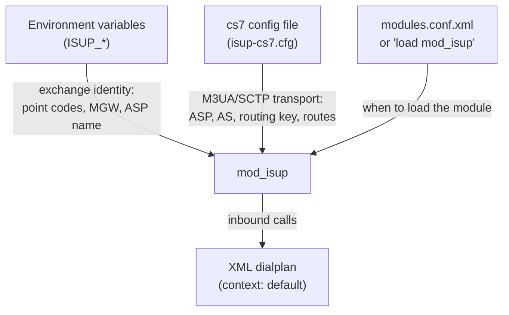

# mod_isup Configuration Reference

`mod_isup` is configured through **two** files plus the FreeSWITCH module loader:



| File | Purpose |
|------|---------|
| **Environment variables** | Identity of this exchange — point codes, MGW address, ASP name, and which cs7 file to read. Supplied to the FreeSWITCH process (e.g. via the systemd unit). |
| **cs7 config file** | The SIGTRAN transport: the M3UA association (ASP) to the STP, the Application Server (AS), the routing key, and the route table. Standard Osmocom `cs7` VTY syntax. |
| **`modules.conf.xml`** | Controls whether the module auto-loads at start-up. It can also be loaded on demand with `load mod_isup`. |

## Configuration File Locations

| Item | Default | Overridden by |
|------|---------|---------------|
| cs7 config file | `/usr/local/freeswitch/conf/isup-cs7.cfg` | `ISUP_CS7_CFG` |
| Module load config | `<conf>/autoload_configs/modules.conf.xml` | — |

---

## Environment Variables

These define the exchange's identity and are read by `mod_isup` when it loads.
They are typically set in the FreeSWITCH service environment (e.g. a systemd
drop-in).

```ini
# Exchange identity
ISUP_OPC=607
ISUP_PEER_DPC=608
ISUP_ASP_NAME=asp-clnt-stp

# Transport config file
ISUP_CS7_CFG=/usr/local/freeswitch/conf/isup-cs7.cfg

# Media gateway
ISUP_MGW=10.179.1.201:2427

# Optional behaviour
ISUP_AUTOANSWER=1
ISUP_SCCP_SSN=8
```

| Parameter | Type | Required | Default | Description |
|-----------|------|----------|---------|-------------|
| `ISUP_OPC` | Integer | No | `1` | This exchange's **Originating Point Code**, as a decimal value. Must match the `point-code` in the cs7 config (expressed there in `network.cluster.member` form) and the point code the STP has provisioned for this exchange. |
| `ISUP_PEER_DPC` | Integer | No | `2` | **Destination Point Code** of the peer exchange that outbound calls (IAM) are routed toward. |
| `ISUP_ASP_NAME` | String | No | `asp` | Name of the M3UA ASP to bring up. **Must exactly match the `asp` name defined in the cs7 config**, otherwise the association is never started and the ASP stays `down`. |
| `ISUP_CS7_CFG` | String | No | `/usr/local/freeswitch/conf/isup-cs7.cfg` | Path to the cs7 transport config file (below). If the file is missing or invalid, the module fails to load. |
| `ISUP_MGW` | String | No | `127.0.0.1:2427` | `host:port` of the MGCP Media Gateway used for the call bearer. |
| `ISUP_AUTOANSWER` | Flag | No | unset (off) | If set to any value, incoming calls are auto-answered by the module (demo/loopback behaviour) instead of being handed to the dialplan for answer control. Leave unset for normal dialplan-driven operation. |
| `ISUP_SCCP_SSN` | Integer | No | `0` (disabled) | If greater than 0, binds an SCCP (SI=3) user on the same M3UA association with this Subsystem Number, reserved for a future TCAP/MAP layer. `0` leaves SCCP off. |

### Fixed profile values

The following are currently fixed in the module (not environment-configurable):

| Value | Setting | Notes |
|-------|---------|-------|
| Profile name | `lab` | Shown in `isup status`. |
| Network Indicator (NI) | `2` (national) | Applied to the outgoing MTP SIO. |
| Inbound context | `default` | Dialplan context for inbound calls — see [Call Routing](./call-routing.md). |
| Inbound dialplan | `XML` | Dialplan engine for inbound calls. |
| Circuit range (CIC) | `1`–`4` | Four voice circuits; up to four concurrent calls. |

---

## cs7 Config File

The cs7 file configures the M3UA/SCTP transport using standard Osmocom `cs7`
VTY syntax (as used by `libosmo-sigtran`). It defines the SCTP association to
the STP, the Application Server, and how ISUP messages are routed.

```
log stderr
 logging level set-all notice
line vty
 no login
cs7 instance 0
 network-indicator international
 point-code 0.75.7
 asp asp-clnt-stp 2905 2906 m3ua
  remote-ip 10.179.4.10
  role asp
  sctp-role client
 as as-clnt-isup m3ua
  asp asp-clnt-stp
  routing-key 20 0.75.7
 route-table system
  update route 0.0.0 0.0.0 linkset as-clnt-isup
```

### Global directives

| Directive | Description |
|-----------|-------------|
| `log stderr` / `logging level set-all notice` | Sends the SIGTRAN stack's own log to stderr at `notice` level. Raise to `debug` when diagnosing association problems. |
| `line vty` / `no login` | Enables the embedded VTY without a login prompt. Required boilerplate. |

### `cs7 instance` parameters

| Parameter | Type | Required | Default | Description |
|-----------|------|----------|---------|-------------|
| `cs7 instance` | Integer | Yes | `0` | The SS7 instance number. `mod_isup` uses instance `0`. |
| `network-indicator` | Enum | Yes | — | SS7 network indicator: `international`, `national`, `national-spare`, or `reserved`. **Must match the STP and peer** (the reference lab uses `international`). |
| `point-code` | Point code | Yes | — | This exchange's own point code, in `network.cluster.member` (3-8-3) form. `0.75.7` = decimal `607`, matching `ISUP_OPC`. |

### `asp` parameters (the M3UA association)

Syntax: `asp <name> <remote-port> <local-port> <protocol>`

| Field | Type | Required | Default | Description |
|-------|------|----------|---------|-------------|
| `<name>` | String | Yes | — | ASP name. **Must equal `ISUP_ASP_NAME`** so the module starts this association. |
| `<remote-port>` | Integer | Yes | `2905` | The STP's SCTP port. M3UA standard port is 2905. |
| `<local-port>` | Integer | Yes | — | The SCTP **source port** this exchange binds. Pin a fixed value (e.g. `2906`) when the STP matches peers by source port, or when running more than one exchange from the same source IP. |
| `<protocol>` | Enum | Yes | `m3ua` | Adaptation layer. `mod_isup` uses `m3ua`. |
| `remote-ip` | IP | Yes | — | The STP's IP address. |
| `role` | Enum | Yes | `asp` | M3UA role. This exchange is always the `asp` (the STP is the SG/server). |
| `sctp-role` | Enum | Yes | `client` | SCTP association role. `client` — this exchange initiates the association to the STP. |

### `as` parameters (the Application Server)

Syntax: `as <name> <protocol>`

| Parameter | Type | Required | Default | Description |
|-----------|------|----------|---------|-------------|
| `as <name>` | String | Yes | — | Application Server name (local label). |
| `<protocol>` | Enum | Yes | `m3ua` | Adaptation layer; `m3ua`. |
| `asp <name>` | Reference | Yes | — | Binds the ASP (above) into this AS. |
| `routing-key` | `<rctx> <point-code>` | Yes | — | The M3UA routing key: the **routing context** the STP expects (`20`) and this exchange's point code (`0.75.7`). The routing context **must match the STP's provisioned peer**, or the STP rejects the association. |

### `route-table` parameters

| Parameter | Type | Required | Default | Description |
|-----------|------|----------|---------|-------------|
| `route-table system` | — | Yes | — | Selects the system route table. |
| `update route <dpc> <mask> linkset <as>` | Route entry | Yes | — | Directs outbound MTP traffic to the AS. `0.0.0 0.0.0` is a default (catch-all) route sending all ISUP messages to the STP via `as-clnt-isup`; the STP forwards them to the real destination point code. |

---

## Loading the Module in FreeSWITCH

`mod_isup` should **not** be auto-loaded at start-up in a way that blocks boot:
its load waits for the M3UA ASP to come up, and if the transport is unavailable
the module reports a load failure. The recommended pattern is to load it on
demand (or after the network is confirmed up) with:

```
fs_cli -x "load mod_isup"
```

To auto-load it, add the following to
`<conf>/autoload_configs/modules.conf.xml` **only** on an exchange where the STP
association is expected to be reachable at start-up:

```xml
<load module="mod_isup"/>
```

See [fs_cli Commands](./fs-cli-commands.md) for verifying the load and reading
status.
